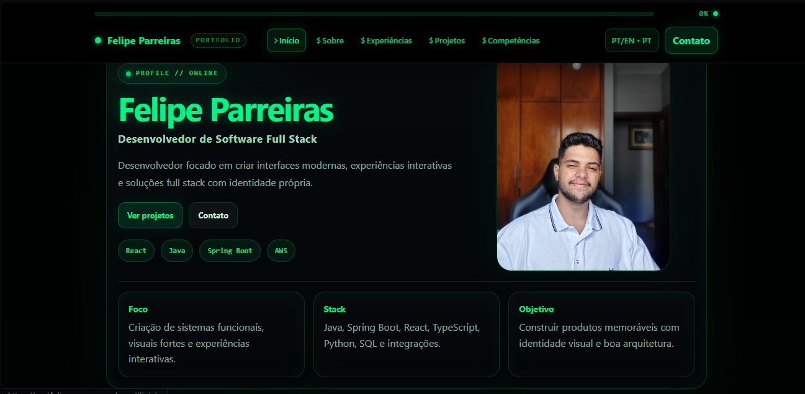
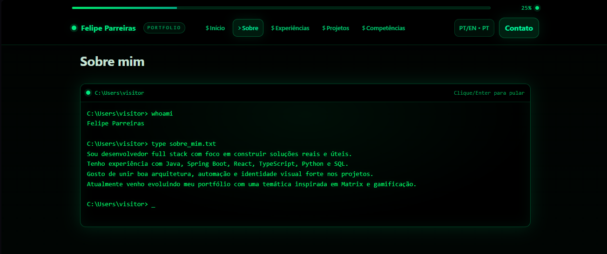
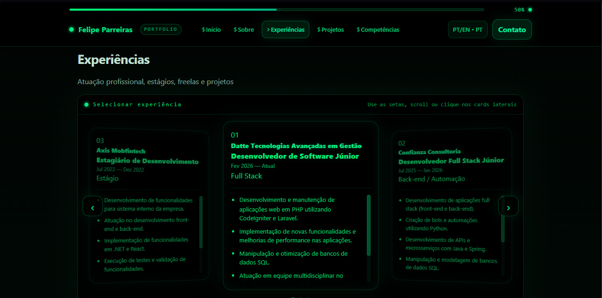
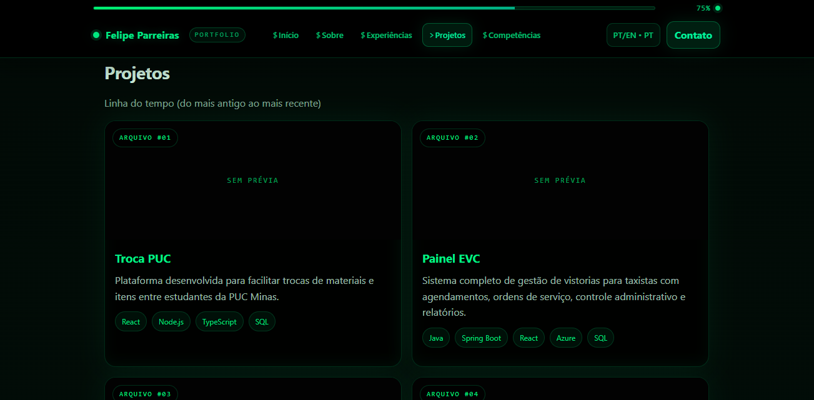
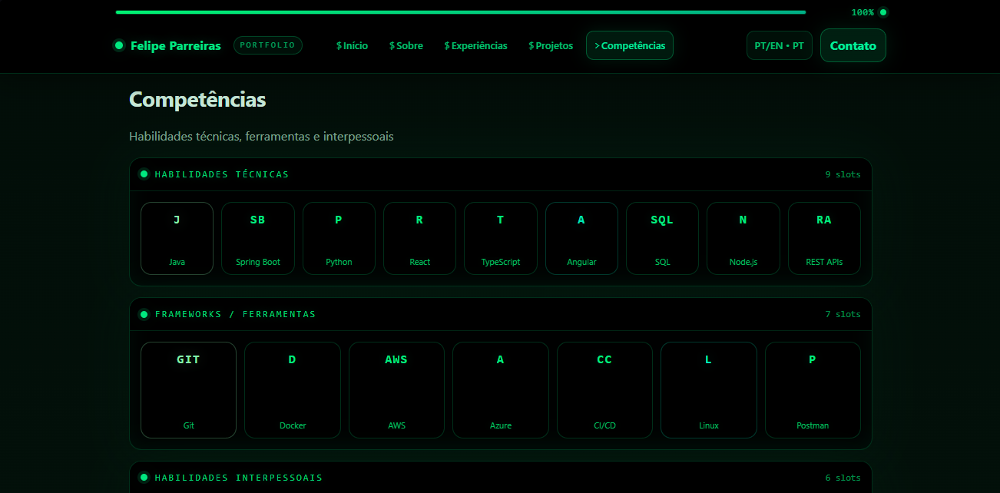
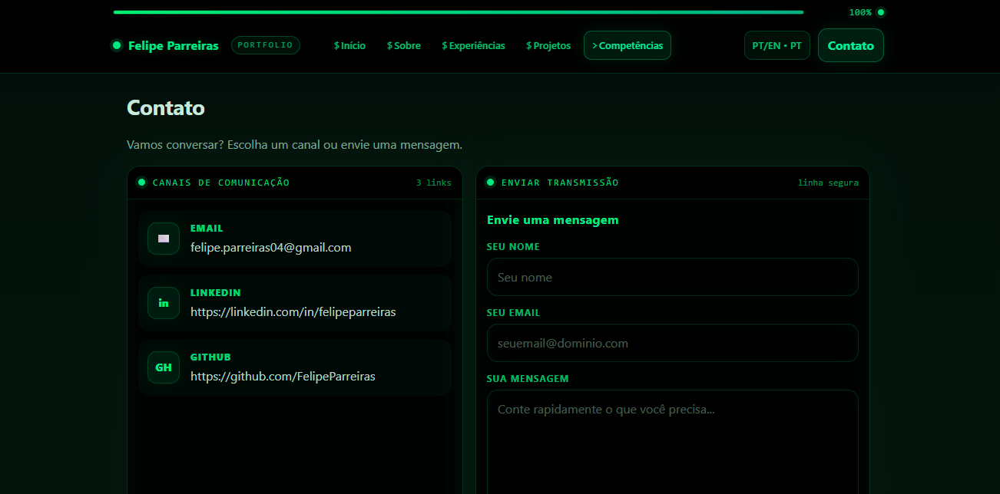

# 🏷️ Portfólio

---

## 🚧 Status do Projeto


---

## 📚 Índice
- [Links Úteis](#-links-úteis)
- [Sobre o Projeto](#-sobre-o-projeto)
- [Funcionalidades](#-funcionalidades)
- [Tecnologias](#-tecnologias)
- [Arquitetura](#-arquitetura)
- [Como Rodar Localmente](#-como-rodar-localmente)
- [Build](#-build)
- [Deploy](#-deploy)
- [Estrutura de Pastas](#-estrutura-de-pastas)
- [Demonstração](#-demonstração)
- [Testes](#-testes)
- [Autores](#-autores)
- [Licença](#-licença)

---

## 🔗 Links Úteis
- 🐙 **Repositório:** https://github.com/PHnsilva/portfolio-grupo.git
- 🌐 **Demo (opcional):** https://portfolio-grupo.vercel.app
- 🧩 **Wireframe:** https://www.figma.com/design/cj6OHrQLX4ekdmerVQJfY4/Untitled?node-id=0-1&t=HXfjQX6N9eGa6xbW-1

---

## 📝 Sobre o Projeto
Este projeto é um **portfólio web** voltado para apresentação profissional, contendo seções como **Home**, **Sobre**, **Projetos**, **Habilidades** e **Contato**.  
A proposta visual pode incorporar uma temática relacionada a jogos, mantendo uma comunicação e estrutura adequadas para uso acadêmico e profissional.

---

## ✨ Funcionalidades
- Página inicial com apresentação geral
- Seção “Sobre” (resumo, objetivos, interesses)
- Seção “Projetos” (cards com título, descrição e links)
- Seção “Habilidades” (stack e competências)
- Seção “Contato” (links e formas de contato) *(a definir por integrante)*
- Minigames clicáveis *(em desenvolvimento / a definir)*

---

## 🛠 Tecnologias
- **React**
- **Vite**
- **TypeScript**
- **Tailwind CSS**

---


---

## Arquitetura

```md
## 🏗️ Arquitetura do Projeto

O projeto segue uma arquitetura **frontend modular** com separação por responsabilidades, facilitando manutenção, reutilização de componentes e personalização por integrante.

### Visão Geral
- **`frontend/src/pages`** → páginas da aplicação (rotas principais)
- **`frontend/src/components`** → componentes reutilizáveis e estrutura visual
- **`frontend/src/data`** → dados estáticos do portfólio (perfil, projetos, skills, etc.)
- **`frontend/src/types`** → tipagens TypeScript compartilhadas
- **`frontend/src/routes`** → configuração central de rotas
- **`frontend/src/assets`** → arquivos estáticos (ícones, imagens, svgs)

---

### Camadas

#### 1) Apresentação (Pages + Components)
Responsável pela interface e renderização dos dados.

- **Pages (`pages/`)**
  - Representam telas completas da aplicação:
  - `Home`, `About`, `Projects`, `ProjectDetails`, `Skills`, `Experience`, `Education`, `Contact`, `NotFound`

- **Components (`components/`)**
  - Componentes reutilizáveis para layout e UI:
  - **Layout/**: estrutura global (`Navbar`, `Footer`, `Layout`)
  - **UI/**: blocos reutilizáveis (`ProjectCard`, `ExperienceCard`, `Tag`, `SectionTitle`)

---

#### 2) Dados (Data)
Responsável por centralizar o conteúdo exibido no portfólio.

Arquivos em `data/`:
- `profile.ts`
- `projects.ts`
- `skills.ts`
- `experience.ts`
- `education.ts`

Essa abordagem facilita:
- personalização por integrante
- manutenção de conteúdo sem alterar componentes
- futura migração para API/backend

---

#### 3) Tipagem (Types)
Responsável por definir contratos de dados com TypeScript.

- `types/portfolio.ts`

Benefícios:
- maior consistência entre dados e componentes
- menos erros em tempo de desenvolvimento
- melhor escalabilidade do projeto

---

#### 4) Roteamento (Routes)
Responsável pela navegação entre páginas.

- `routes/AppRoutes.tsx`

Centraliza as rotas da aplicação e mantém a navegação organizada.

---

### Fluxo de Renderização (resumo)

1. `main.tsx` inicializa a aplicação
2. `App.tsx` carrega a estrutura principal
3. `AppRoutes.tsx` define qual página será exibida
4. As páginas consomem dados de `data/`
5. Os componentes de `components/` renderizam os blocos visuais reutilizáveis

---

### Princípios adotados
- **Separação de responsabilidades**
- **Reutilização de componentes**
- **Tipagem com TypeScript**
- **Organização escalável por domínio**
- **Facilidade de personalização do conteúdo**

---

## 🔧 Como Rodar Localmente

### Pré-requisitos
- Node.js (LTS)
- npm (ou yarn/pnpm)

### Instalação
```bash
# na raiz do repositório
cd frontend
npm install
```

### Ambiente de desenvolvimento
```bash
npm run dev
```

Acesse: `http://localhost:5173`

### Variáveis de ambiente

```env
# exemplo
VITE_SITE_NAME="Portfólio"
```

---

## 🧱 Build
```bash
cd frontend
npm run build
npm run preview
```

---

## 🚀 Deploy
Opções comuns:
- Vercel

---

## 📁 Estrutura do Projeto

```text
portfolio-grupo/
├─ docs/
├─ frontend/
│  ├─ node_modules/
│  ├─ public/
│  ├─ src/
│  │  ├─ assets/
│  │  │  └─ react.svg
│  │  ├─ components/
│  │  │  ├─ Layout/
│  │  │  │  ├─ Footer.tsx
│  │  │  │  ├─ Layout.tsx
│  │  │  │  └─ Navbar.tsx
│  │  │  └─ UI/
│  │  │     ├─ ExperienceCard.tsx
│  │  │     ├─ ProjectCard.tsx
│  │  │     ├─ SectionTitle.tsx
│  │  │     └─ Tag.tsx
│  │  ├─ data/
│  │  │  ├─ education.ts
│  │  │  ├─ experience.ts
│  │  │  ├─ profile.ts
│  │  │  ├─ projects.ts
│  │  │  └─ skills.ts
│  │  ├─ pages/
│  │  │  ├─ About.tsx
│  │  │  ├─ Contact.tsx
│  │  │  ├─ Education.tsx
│  │  │  ├─ Experience.tsx
│  │  │  ├─ Home.tsx
│  │  │  ├─ NotFound.tsx
│  │  │  ├─ ProjectDetails.tsx
│  │  │  ├─ Projects.tsx
│  │  │  └─ Skills.tsx
│  │  ├─ routes/
│  │  │  └─ AppRoutes.tsx
│  │  ├─ types/
│  │  │  └─ portfolio.ts
│  │  ├─ App.css
│  │  ├─ App.tsx
│  │  ├─ index.css
│  │  └─ main.tsx
│  ├─ .gitignore
│  ├─ eslint.config.js
│  ├─ index.html
│  ├─ package-lock.json
│  ├─ package.json
│  ├─ README.md
│  ├─ tsconfig.app.json
│  ├─ tsconfig.json
│  ├─ tsconfig.node.json
│  └─ vite.config.ts
├─ .gitignore
├─ LICENSE
└─ README.md
```

---

## 🎥 Demonstração

### Início


### Sobre


### Experiência


### Projetos


### Competências


### Contato


---

## 🧪 Testes
Ainda não há testes automatizados.

---

## 👥 Autores
Projeto em grupo (3 integrantes).  


| Nome | GitHub | LinkedIn |
|------|--------|----------|
| Pedro .H.S | https://github.com/PHnsilva | https://www.linkedin.com/in/phnsilva1/ |
| Felipe .P | https://github.com/FelipeParreiras | https://www.linkedin.com/in/felipe-parreiras04/ |
| Gabriel .P | https://github.com/GpNonato | www.linkedin.com/in/gabriel-nonato-3a3a98376 |

---

## 📄 Licença
Este projeto está sob a licença **MIT**. Veja o arquivo `LICENSE`.
