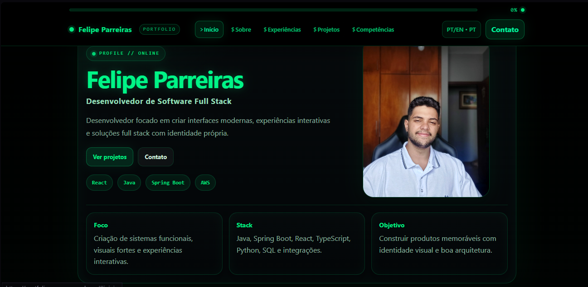
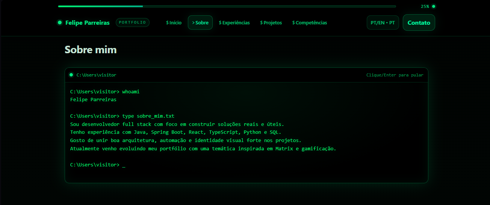
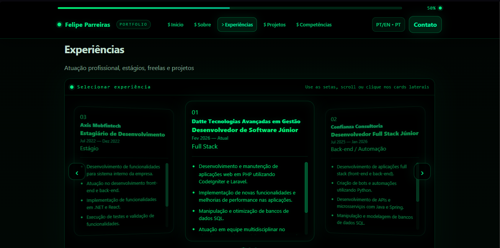
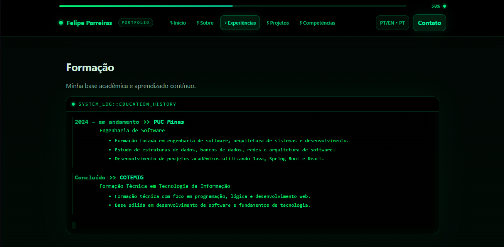
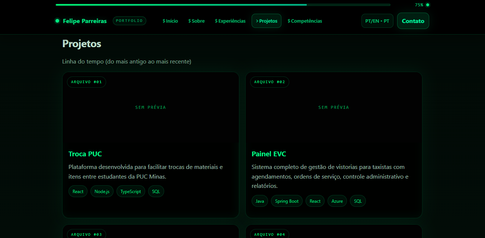
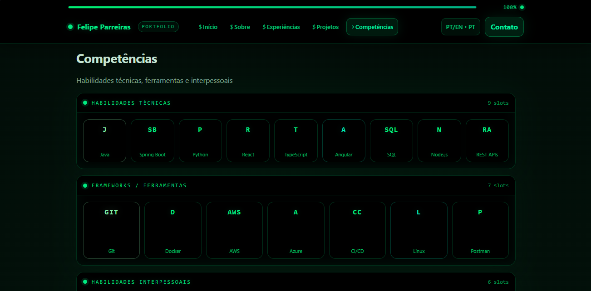
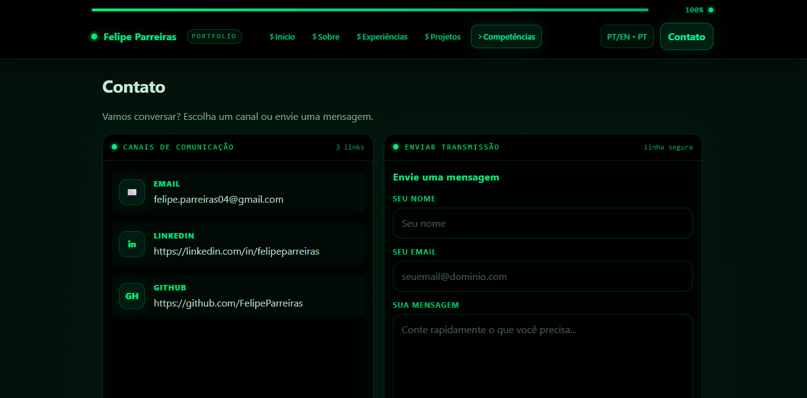

# 🏷️ Portfólio

Portfólio web desenvolvido em grupo com foco em apresentação profissional, organização de conteúdo e experiência visual interativa.  
A aplicação reúne informações sobre perfil, experiências, formação, projetos, competências e contato, além de incluir elementos diferenciados como **suporte a múltiplos idiomas** e um **minigame Flappy** integrado ao projeto.

---

## 🚧 Status do Projeto


---

## 📚 Índice
- [Links Úteis](#-links-úteis)
- [Sobre o Projeto](#-sobre-o-projeto)
- [Funcionalidades](#-funcionalidades)
- [Tecnologias](#-tecnologias)
- [Arquitetura](#-arquitetura)
- [Como Rodar Localmente](#-como-rodar-localmente)
- [Build](#-build)
- [Deploy](#-deploy)
- [Estrutura de Pastas](#-estrutura-de-pastas)
- [Demonstração](#-demonstração)
- [Testes](#-testes)
- [Autores](#-autores)
- [Licença](#-licença)

---

## 🔗 Links Úteis
- 🐙 **Repositório:** https://github.com/PHnsilva/portfolio-grupo.git
- 🌐 **Demo:** https://portfolio-grupo.vercel.app
- 🧩 **Wireframe:** https://www.figma.com/design/cj6OHrQLX4ekdmerVQJfY4/Untitled?node-id=0-1&t=HXfjQX6N9eGa6xbW-1

---

## 📝 Sobre o Projeto
Este projeto é um **portfólio web responsivo** criado para apresentar informações acadêmicas e profissionais de forma moderna, organizada e personalizável.  

A aplicação foi estruturada em seções independentes, facilitando a manutenção e a adaptação do conteúdo para diferentes integrantes do grupo. Entre os destaques do projeto estão:

- navegação por páginas e seções bem definidas;
- exibição de perfil, experiências, formação, projetos, competências e contato;
- detalhamento de projetos em rota específica;
- suporte a **internacionalização (PT/EN)**;
- componente interativo com **minigame Flappy**;
- organização modular com **React + TypeScript + CSS Modules**.

---

## ✨ Funcionalidades
- Página inicial com apresentação do perfil
- Seção **Sobre**
- Seção **Experiência**
- Seção **Formação**
- Seção **Projetos**
- Seção **Competências**
- Seção **Contato**
- **Internacionalização** com troca de idioma
- **Minigame Flappy** integrado à experiência do site
- Layout reutilizável com **Navbar** e **Footer**
- Página **Not Found** para rotas inválidas

---

## 🛠 Tecnologias
- **React**
- **Vite**
- **TypeScript**
- **CSS Modules**
- **React Router**
- **ESLint**

---

## 🏗️ Arquitetura

O projeto segue uma arquitetura **frontend modular**, separada por responsabilidades, tornando o código mais organizado, reutilizável e escalável.

### Visão Geral
- **`frontend/src/pages`** → páginas principais da aplicação
- **`frontend/src/components`** → componentes reutilizáveis e estruturais
- **`frontend/src/data`** → dados estáticos do portfólio
- **`frontend/src/types`** → tipagens TypeScript compartilhadas
- **`frontend/src/routes`** → configuração central de rotas
- **`frontend/src/i18n`** → dicionários e provider de internacionalização
- **`frontend/src/styles`** → estilos modulares por página/componente
- **`frontend/src/assets`** → arquivos visuais estáticos

### Camadas

#### 1) Apresentação
Responsável pela interface e renderização visual do conteúdo.

**Páginas (`pages/`)**
- `Home`
- `About`
- `Experience`
- `Education`
- `Projects`
- `ProjectDetails`
- `Skills`
- `Contact`
- `NotFound`

**Componentes (`components/`)**
- **Layout/** → estrutura global da aplicação
  - `Navbar`
  - `Footer`
  - `Layout`
- **UI/** → blocos reutilizáveis da interface
  - `SectionTitle`
  - `ProjectCard`
  - `ExperienceCard`
  - `Tag`
  - `TerminalText`
  - `RareProfessionalIntro`
- **Flappy/** → componentes do minigame
  - `FlappyGame`
  - `FlappyWidget`
  - `useReachedBottom`

#### 2) Dados
Responsável por centralizar os conteúdos exibidos nas páginas.

Arquivos em `data/`:
- `profile.ts`
- `experience.ts`
- `education.ts`
- `projects.ts`
- `skills.ts`

Essa abordagem facilita:
- personalização por integrante;
- manutenção sem alterar a lógica visual;
- futura integração com APIs ou CMS.

#### 3) Internacionalização
Responsável pela tradução e troca de idioma do site.

Arquivos em `i18n/`:
- `dictionaries.ts`
- `I18nProvider.tsx`

Permite manter o conteúdo em múltiplos idiomas de forma centralizada e reutilizável.

#### 4) Tipagem
Responsável por definir contratos de dados com TypeScript.

Arquivo:
- `types/portfolio.ts`

Benefícios:
- consistência entre dados e componentes;
- melhor manutenção;
- redução de erros em tempo de desenvolvimento.

#### 5) Roteamento
Responsável pela navegação entre páginas e rotas da aplicação.

Arquivo:
- `routes/AppRoutes.tsx`

### Fluxo de Renderização
1. `main.tsx` inicializa a aplicação
2. `App.tsx` carrega a estrutura principal
3. `AppRoutes.tsx` define a rota exibida
4. As páginas consomem dados de `data/`
5. Os componentes reutilizáveis constroem a interface
6. O provider de `i18n` controla o idioma ativo

### Princípios adotados
- Separação de responsabilidades
- Reutilização de componentes
- Tipagem forte com TypeScript
- Organização escalável
- Facilidade de personalização
- Estrutura preparada para evolução futura

---

## 🔧 Como Rodar Localmente

### Pré-requisitos
- Node.js (versão LTS recomendada)
- npm

### Instalação
```bash
cd frontend
npm install

### Ambiente de desenvolvimento
```bash
npm run dev
```

A aplicação ficará disponível em:

```bash
http://localhost:5173
```

---

## 🧱 Build
```bash
cd frontend
npm run build
npm run preview
```

---

## 🚀 Deploy
O projeto pode ser publicado facilmente em plataformas de hospedagem para frontend estático, como:

- **Vercel**
- **Netlify**

---

## 📁 Estrutura de Pastas

```txt
.
├── docs/
│   └── prints/
│       ├── competencias.png
│       ├── contatos.png
│       ├── experiencias.png
│       ├── formacao.png
│       ├── inicio.png
│       ├── projetos.png
│       └── sobre.png
│
├── frontend/
│   ├── dist/
│   ├── node_modules/
│   ├── public/
│   ├── src/
│   │   ├── assets/
│   │   │   └── react.svg
│   │   │
│   │   ├── components/
│   │   │   ├── Flappy/
│   │   │   │   ├── FlappyGame.tsx
│   │   │   │   ├── FlappyWidget.tsx
│   │   │   │   └── useReachedBottom.ts
│   │   │   │
│   │   │   ├── Layout/
│   │   │   │   ├── Footer.tsx
│   │   │   │   ├── Layout.tsx
│   │   │   │   └── Navbar.tsx
│   │   │   │
│   │   │   └── UI/
│   │   │       ├── ExperienceCard.tsx
│   │   │       ├── ProjectCard.tsx
│   │   │       ├── RareProfessionalIntro.tsx
│   │   │       ├── SectionTitle.tsx
│   │   │       ├── Tag.tsx
│   │   │       └── TerminalText.tsx
│   │   │
│   │   ├── data/
│   │   │   ├── education.ts
│   │   │   ├── experience.ts
│   │   │   ├── profile.ts
│   │   │   ├── projects.ts
│   │   │   └── skills.ts
│   │   │
│   │   ├── i18n/
│   │   │   ├── dictionaries.ts
│   │   │   └── I18nProvider.tsx
│   │   │
│   │   ├── pages/
│   │   │   ├── About.tsx
│   │   │   ├── Contact.tsx
│   │   │   ├── Education.tsx
│   │   │   ├── Experience.tsx
│   │   │   ├── Home.tsx
│   │   │   ├── NotFound.tsx
│   │   │   ├── ProjectDetails.tsx
│   │   │   ├── Projects.tsx
│   │   │   └── Skills.tsx
│   │   │
│   │   ├── routes/
│   │   │   └── AppRoutes.tsx
│   │   │
│   │   ├── styles/
│   │   │   ├── About.module.css
│   │   │   ├── Contact.module.css
│   │   │   ├── Education.module.css
│   │   │   ├── Experience.module.css
│   │   │   ├── ExperienceCard.module.css
│   │   │   ├── Home.module.css
│   │   │   ├── Navbar.module.css
│   │   │   ├── Projects.module.css
│   │   │   ├── RareProfessionalIntro.module.css
│   │   │   └── Skills.module.css
│   │   │
│   │   ├── types/
│   │   │   └── portfolio.ts
│   │   │
│   │   ├── App.tsx
│   │   ├── index.css
│   │   ├── main.tsx
│   │   ├── shims.d.ts
│   │   └── vite-env.d.ts
│   │
│   ├── .gitignore
│   ├── eslint.config.js
│   ├── index.html
│   ├── package-lock.json
│   ├── package.json
│   ├── README.md
│   ├── tsconfig.app.json
│   ├── tsconfig.json
│   ├── tsconfig.node.json
│   └── vite.config.ts
│
├── LICENSE
└── README.md
```

---

## 🎥 Demonstração

### Início


### Sobre


### Experiência


### Formação


### Projetos


### Competências


### Contato


### Minigame Flappy
O projeto também inclui um **minigame Flappy**, utilizado como elemento interativo para enriquecer a experiência do usuário durante a navegação.

---

## 👥 Autores

Projeto desenvolvido em grupo.

| Nome | GitHub | LinkedIn |
|------|--------|----------|
| Pedro H. S. | https://github.com/PHnsilva | https://www.linkedin.com/in/phnsilva1/ |
| Felipe P. | https://github.com/FelipeParreiras | https://www.linkedin.com/in/felipe-parreiras04/ |
| Gabriel P. | https://github.com/GpNonato | https://www.linkedin.com/in/gabriel-nonato-3a3a98376/ |

---

## 📄 Licença
Este projeto está sob a licença **MIT**.  
Consulte o arquivo `LICENSE` para mais detalhes.